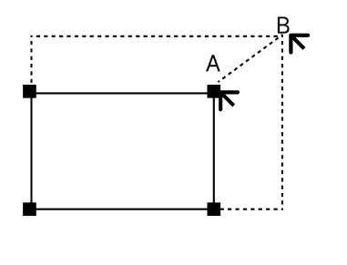

# Assessment 4 - ReactJS: Presto

### 2.1. Feature Set 1. Login & presentation Creation (10%)

This feature set focuses solely on the ability to register, login, and logout. It does not concern itself with any functionality or screens that come after logged in - if the dashboard when logged in is just a blank screen with a logout button, then that is satisfactory for this feature set.

#### 2.1.1. Login Screen
 * A unique route must exist for this screen
 * User must be able to enter their `email` and `password` in a form
 * A button must exist to allow submission of the form
 * If the form submission fails when user tried to login, a reasonable error message should be shown
 * The login form must be able to be submitted on enter key, pressing enter key to login should be an alternative option along with clicking a button
 * Successfully login will take user to the dashboard screen

#### 2.1.2. Register Screen
 * A unique route must exist for this screen
 * User must be able to enter their `email` and `password` and `name` in a form
 * A confirm `password` field should exist where user re-enters their password
 * If the two passwords don't match, the user should receive an error popup before submission.
 * If the form submission fails when user tried to register, a reasonable error message should be shown
 * A button must exist to allow submission of form
 * The register form must be able to be submitted on enter key, pressing enter key to register should be an alternative option along with clicking a button
 * Successfully register will take user to the dashboard screen

#### 2.1.3. Logout Button
 * On all screens that require an authorised user, a logout button exists.
 * This logout button, when clicked, returns you to the login screen.

### 2.2. Feature Set 2. Setting up slides (13%)

#### 2.2.1. New presentation on Dashboard

* When logged in, users should be presented with a dashboard that contains a button, only visible on the dashboard, called "New presentation".
* When this button is pressed, a [modal](https://www.w3schools.com/w3css/w3css_modal.asp) appears, where a user can enter the name of a new presentation
* This modal should contain a "Create" button for user to click and create presentation. The modal should disappear after user clicked "Create" button, a new presentation is created and appears on the dashboard. A default presentation contains a single empty slide (info on this later).

#### 2.2.2. List of presentations on Dashboard 

* A unique route must exist for dashboard screen
* On the dashboard, the [card](https://m1.material.io/components/cards.html#) for each presentation should appear as rectangles with a 2:1 width:height ratio.
* Each rectangle should include the name, a thumbnail (grey square if empty), a description (no text if empty) and the number of slides it contains
* Rectangles should be evenly spaced in several rows and columns if needed, where each rectangle has a minimum of `100px` width, the actual width of rectangles in different viewports should look reasonable.

#### 2.2.3. Basics of a presentation controls

* When a particular presentation on the dashboard is clicked, the user should be taken to a new unique route that is parameterised by the presentation ID, which always loads the first slide in the slideshow deck. This route is for editing a specific presentation, users can add/delete/edit(Info on this later) slides in this presentation within this page.
* When on this edit presentation page, Two key controls should always be visible and functional, regardless of which slide users are on:
  * "Back" that takes users back to the dashboard.
  * "Delete Presentation" which prompts "Are you sure?", where if "Yes" is clicked, the presentation is deleted and users are taken to the dashboard. If "No" is clicked, then the prompt disappears and the page remains still.

#### 2.2.4. Title & Thumbnail editing

* When viewing a particular presentation, the title of the presentation should be visible at all times somewhere on or above the slideshow deck regardless of which slide users are on.
  * Somewhere near the title should have some text/icon/graphic/button that user can click to bring up a modal to edit the title of the presentation.

* There should be a way on presentation screen which allows user to update the thumbnail of the presentation. 

#### 2.2.5. Creating slides & moving between

* When visiting a particular slide, a button should be visible off the slides that allows users to create a new slide.
* Creating a new slide will add another slide at the end of the slideshow deck.
* Once the slideshow deck has at least two slides, controls should appear at a reasonable position in the slideshow deck:
  * These controls should be two arrows, left and right.
  * When users click on these arrows, it takes them to the next or previous slide
  * When users click the associated keyboard keys(**left key** and **right key** in this case), the same corresponding action should happen
  * If users are viewing the first slide, there should be no previous arrow
  * If users are viewing the last slide, there should be no next arrow

#### 2.2.6. Deleting slides

* When visiting a particular slide, a button should be visible off the slide, which allows users to delete that slide.
* If a user tried to delete the only slide in the slideshow deck, an error should appear instead asking to delete the presentation.

Note: The behaviour after current slide is deleted could be implemented entirely up to your design. E.G. *redirect user to the previous slide*

#### 2.2.7. Slide numbers

* When viewing a particular slide, the slide number should be visible within the slide, position at the **bottom left**. The font-size should be `1em` of any colour, and it should be visible only within a `50px` by `50px` area. When you only have one slide left, this number will just be "1".

### 2.3. Feature Set 3. Putting Elements on a slide (14%)

* Any time when users are prompted for the "size" of an element below, size is always represented in percentage(%) as a number between 0 and 100 where:
  * For width, 100 represents the full width of the deck, 50 represents half the width, etc etc
  * For height, 100 represents the full height of the deck, 50 represents half the height, etc etc
* When any element is first added to the slide, it is always positioned at the top left corner of the slide.
* Double clicking (within 0.5 seconds) on any element in a slide will allow you to edit the initial properties(discussed in later scope) that are set when this element was created, as well as an extra property called *position* that describes where the top left of the element will appear on the slide. This property is expressed as an `x` and `y` co-ordinate between `0` and `100` (similar to what is described above).
* You can order the "layer" property of each element by having the most recent created element be higher than the previous one. This will help in situations where they are layered on top of one another.
* Each element in a slide can be deleted by right clicking anywhere within its block.

#### 2.3.1. Putting TEXT on the slide

* Somewhere on the slideshow edit screen, for each slide, there should be an action that is clearly described as adding a text box to the current slide. This action can be immediately visible in a list of tools, or can be hidden away by some kind of collapsable panel.
  * When this action is clicked, a modal should appear and accept inputs from users for 
    1) The size of the text area 
    2) The text in the textarea 
    3) The font size of the text in `em` as a decimal
    4) The colour the text as a [HEX color code](https://www.w3schools.com/css/css_colors_hex.asp).
  * The text is always top-down and left-aligned.
  * If any text overflows, it can simply be cut off.
* Each block should have a soft grey border around the outside of it.

#### 2.3.2. Putting an IMAGE on the slide

* Somewhere on the slideshow edit screen, for each slide, there should be an action that is clearly described as adding an image to the current slide. This action can be immediately visible in a list of tools, or can be hidden away by some kind of collapsable panel.
  * When this action is clicked, a modal should appear and accept inputs from users for 
    1) The size of the image area 
    2) Either the URL or a file from local system being parsed to base64 string encoding of the whole image itself 
    3) A description of the image for an `alt` tag
  
#### 2.3.3. Putting a VIDEO on the slide

* Somewhere on the slideshow edit screen, for each slide, there should be an action that is clearly described as adding a video to the current slide. This action can be immediately visible in a list of tools, or can be hidden away by some kind of collapsable panel.
  * When this action is clicked, a modal should appear and accept inputs from users for 
    1) The size of the video area
    2) The URL of the youtube video to display 
    3) Whether or not the video should auto-play
  
#### 2.3.4. Putting CODE on the slide

* Somewhere on the slideshow edit screen, for each slide, there should be an action that is clearly described as adding a code block to the current slide. Code block is presented by a `textarea`. This action can be immediately visible in a list of tools, or can be hidden away by some kind of collapsable panel. Each code block only contains one programming language.
  * When this action is clicked, a modal should appear and accept inputs from users for 
    1) The size of the textarea
    2) The code in the textarea 
    3) The font size of the text in `em` as a decimal 
* The code entered should have whitespace preserved when displayed on screen
* The code should not have its `font-family` changed if you completed `2.4.1`
* The code should also be syntax highlighted appropriately to the language being chosen:
  * Valid languages are C, Python, Javascript
  * This element should be able to distinguish between different programming languages based on the input automatically

#### 2.3.5. 🙉🙉🙉 Making elements movable

* For all of `2.3.1`, `2.3.2`, `2.3.3`, `2.3.4`, and `2.3.5`, change it so that:
  * When you double click on a block, it no longer displays the position as an option to edit the location of the block
  * When you click on a block once, each of the 4 corners should now have a small `5px` x `5px` solid box on it, whereby:
    * If the user clicks and drags the box, they can change the position of the box (maintaining aspect ratio).
    * The block cannot have any of its corners extend beyond the edges of the slide.

#### 2.3.6. 🙉🙉🙉 Making elements resizable

* For all of `2.3.1`, `2.3.2`, `2.3.3`, `2.3.4`, and `2.3.5`, change it so that:
  * When you double click on a block, it no longer displays the position as an option to edit the size of the block
  * When you click on a block once, each of the 4 corners should now have a small `5px` x `5px` solid box on it, whereby:
    * If the user clicks and drags the corners, they can increase or decrease the size of the box.
    * The block cannot be resized smaller than `1%` of width or height.
    * The block cannot have any of its corners extend beyond the edges of the slide.
    * An example of this behaviour can be described as:
     
      

### 2.4. Feature Set 4. Further Features (13%)

#### 2.4.1. Font adjustment

* For each text box on the slide, on the slideshow edit screen, the user should be able to change its `font-family`, the user should be able to choose from at least 3 different font-famlies.

#### 2.4.2. Theme and background picker

* There should be a button, visible on all slides, when users click on it and it brings up a modal.
* In this modal, you can specify both:
  * The current slide's background in one solid colour, or in a colour gradient; 
  * The default background solid colour or colour gradient of all slides
    * This is the colour that a slide background is set to by default instead of white.
  * When user has a current slide background, it will overwrite the default slide background

  Note: You are free to choose from different gradient directions(E.G. top to down/left to right). It's fully up to you to design a UI that allow users to choose different background options and colours

#### 2.4.3. Preview viewing

* Each slideshow deck should have a button somewhere (immediately visible or behind a panel) that users can click to preview the presentation
* Previewing the presentation simply opens another tab/window where:
  * The slideshow deck is visible to the full size of the screen in your browser
  * The arrow controls and slide numbers are still visible and functional, clicking on the arrows should display the previous/next slide accordingly.
  * Each block should have no border around it.

#### 2.4.4. URL Updating

* For both editing a slideshow deck and previewing presentation, when on a particular slide, the slide number should be reflected in the URL such that if the page is refreshed, the current user will be navigated to the same page.
 
#### 2.4.5. 🙉🙉🙉Slide transitioning

* Add at least one form of animation when transitioning between slides in the slideshow deck. Examples of this may be:
  * Swipe left/right
  * Fade in and out or cross-fade

#### 2.4.6. 🙉🙉🙉Slide Re-arranging

* A button should be accessible on every slideshow deck (either immediately, or behind a control panel) that brings up the slide re-arrange screen.
* The slide re-arrange screen should display every slide as a rectangle, where each slide has a number inside it to indicate the index of the slide among all slides.
* The rectangles should be sized such that they can all fit on the viewport (assuming less than 10 slides).
* Users can click and drag a particular slide and drop it between another two slides to re-arrange it.
* There is a close button to exit this screen.

